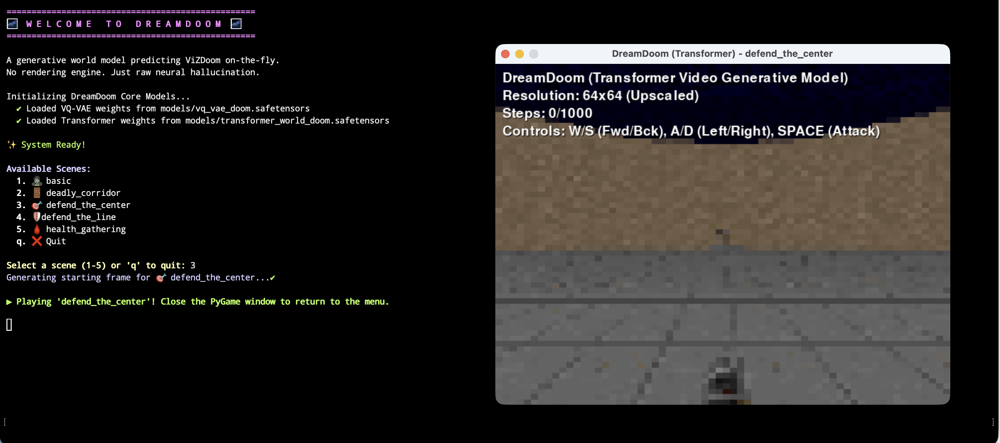

# 🌍 DreamDoom: A Generative World Model



[](LICENSE)

**DreamDoom** is an experimental prototype exploring **Generative Video Models**.

Imagine a system that doesn't just play a game, but *understands* how to generate the visual output of the game frame-by-frame entirely via a neural network. This project provides a sequence-to-sequence video prediction model trained on ViZDoom, allowing you to "play" the hallucinated game interactively. 

[](https://youtu.be/dzzbb4pvDZk)

---

## ✨ Key Features

- **🎨 VQ-VAE Tokenization**: Discretizes 64x64 visual frames into an 8x8 grid of discrete latent tokens (vocabulary size: 512).
- **🧠 Autoregressive Transformer**: A high-capacity Transformer (512 dims, 8 layers, 8 heads) that predicts the next sequence of visual tokens based on current state and user actions.
- **🕹️ Interactive Hallucination**: An interactive Gym environment where you control the game visually rendered entirely by the neural world model.
- **🚀 Diverse Scenarios**: Supports multiple ViZDoom scenarios including Basic, Deadly Corridor, Defend the Center, and more.

---

## 🛠️ Getting Started

### Installation

Ensure you have Python 3.9+ and the necessary system dependencies for PyGame and ViZDoom.

```bash
# Set up your environment
python3 -m venv venv
source venv/bin/activate

# Install dependencies
pip install -r requirements.txt
```

### 1. Pre-trained Models

Download the pre-trained data and models directly from our Hugging Face repository:
🤗 **[homerquan/Worldlet-Concept-Demo](https://huggingface.co/homerquan/Worldlet-Concept-Demo)**

Place the `models/` directory in the root of this project.

### 2. Enter the Dream!

Launch the interactive generated world:

```bash
python3 dream_doom.py
```

Upon launching, the interactive menu will allow you to select the backend Generative World Model you wish to use (e.g., DiT, Transformer, or CNN).

**Controls**:
- **W / S** or **Up / Down Arrow**: Move Forward / Backward
- **A / D** or **Left / Right Arrow**: Move Left / Right
- **Spacebar**: Attack

---

## 🧪 Experiments and Training Pipelines

This repository serves as a testbed for various generative world modeling and reinforcement learning architectures. We have several parallel training pipelines exploring different methods:

- **`train_dit.py` (Diffusion Transformer)**: Trains a continuous DiT World Model. Instead of discrete tokens, it learns to iteratively denoise the continuous latent representations of the next frame. *This is our most advanced generative experiment.*
- **`train_vqvae_gan.py` (VQ-GAN)**: An experimental script to train a VQ-GAN (adding a PatchGAN discriminator and perceptual loss) to improve the visual fidelity of the encoded latents over a standard VQ-VAE.
- **`transformer_world.py` / `train_cli.py` (Autoregressive Transformer)**: The original discrete token sequence-to-sequence model (similar to GPT) that predicts the next 64 visual tokens autoregressively.
- **`train_nano.py`**: A baseline experiment to train a standard Reinforcement Learning agent (PPO) directly on the environment to verify mechanics and collect optimal trajectories before generative modeling.

To run the DiT training pipeline, for example:
```bash
python3 train_dit.py
```

---

## 🏗️ Architecture Details

The system consists of two primary components:

1.  **VQ-VAE**: Encodes 64x64x3 RGB frames into 8x8 grids of discrete tokens. This compresses the visual space and allows the model to work with a discrete vocabulary.
2.  **Transformer**: A causal decoder-only transformer. It receives a sequence of 64 visual tokens followed by an action token (offset by 512), and autoregressively predicts the next 64 visual tokens for the subsequent frame.

---

## ⚖️ License

This project is licensed under the MIT License - see the [LICENSE](LICENSE) file for details.
